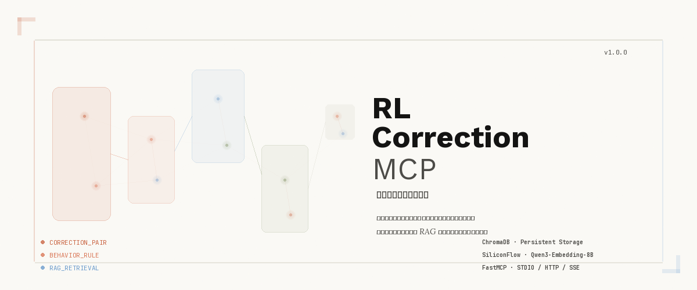

<p align="center">
  
</p>

<p align="center">
  <strong>不修改模型权重，通过 RAG 注入上下文引导模型行为。</strong><br/>
  <em>记录每一次错误 · 检索每一段记忆 · 修正每一个输出</em>
</p>

<p align="center">
  <a href="#快速开始"></a>
  <a href="https://github.com/xiangbianpangde/rl-correction-mcp/blob/master/LICENSE"></a>
  <a href="https://www.python.org/downloads/"></a>
  <a href="https://pypi.org/project/mcp/"></a>
</p>

---

## 项目概述

**RL Correction MCP** 是一个基于强化学习思想的辅助修正装置，采用 MCP (Model Context Protocol) 协议。它通过 **RAG (检索增强生成)** 机制，在不修改模型权重的前提下，根据历史修正记录动态注入上下文，引导模型做出更准确的输出。

本系统采用创新的 **三链存储架构**（输入链 → 输出链 → 逻辑链），完整记录每一次修正的上下文、错误输出、正确输出以及推理过程。

| 特性 | 说明 |
|------|------|
| 🔧 **零侵入修正** | 不修改模型权重，通过上下文注入引导行为 |
| 🧠 **三链存储** | 输入链、输出链、逻辑链完整记录修正过程 |
| 📊 **向量检索** | 基于 ChromaDB 的语义相似度搜索 |
| 🌐 **Web 管理界面** | Vue 3 构建的现代化管理后台 |
| 🎨 **粒子流动画** | 侧边栏 Perlin 噪声粒子流背景动画 |
| 🌓 **深色模式** | 支持亮色/深色主题切换 |

---

## 系统架构

```
┌─────────────────────────────────────────────────┐
│                  MCP Server                      │
│  ┌──────────┐  ┌──────────┐  ┌──────────────┐  │
│  │  STDIO   │  │   HTTP   │  │     SSE      │  │
│  └────┬─────┘  └────┬─────┘  └──────┬───────┘  │
│       └──────────────┼──────────────┘           │
│                      ▼                          │
│  ┌─────────────────────────────────────────┐    │
│  │           三链存储引擎                     │    │
│  │  ┌─────────┐ ┌─────────┐ ┌───────────┐  │    │
│  │  │ 输入链   │ │ 输出链   │ │  逻辑链    │  │    │
│  │  └────┬────┘ └────┬────┘ └─────┬─────┘  │    │
│  │       └───────────┼────────────┘         │    │
│  │                   ▼                      │    │
│  │  ┌─────────────────────────────────┐     │    │
│  │  │      ChromaDB 向量存储            │     │    │
│  │  └─────────────────────────────────┘     │    │
│  └─────────────────────────────────────────┘    │
│                      │                          │
│                      ▼                          │
│  ┌─────────────────────────────────────────┐    │
│  │  SiliconFlow · Qwen3-Embedding-8B        │    │
│  │  向量嵌入服务                              │    │
│  └─────────────────────────────────────────┘    │
│                      │                          │
│                      ▼                          │
│  ┌─────────────────────────────────────────┐    │
│  │        Vue 3 Web 管理界面                 │    │
│  └─────────────────────────────────────────┘    │
└─────────────────────────────────────────────────┘
```

---

## 快速开始

### 环境要求

- Python 3.10+
- Node.js 18+
- npm 或 pnpm

### 1. 安装依赖

```bash
# Python 依赖
pip install -r requirements.txt

# 前端依赖
cd web && npm install
```

### 2. 配置环境变量

```bash
# 复制配置文件
cp .env.example .env

# 编辑 .env 填入你的配置
# SILICONFLOW_API_KEY=your_key_here
```

### 3. 启动服务

```bash
# 终端 1 — 启动后端 MCP Server
python server.py

# 终端 2 — 启动前端 Web 界面
cd web && npm run dev
```

### 4. 访问界面

打开浏览器访问 **http://localhost:5173**

---

## MCP 客户端配置

### Claude Desktop

```json
{
  "mcpServers": {
    "rl-correction": {
      "command": "python",
      "args": ["/path/to/server.py"],
      "env": {
        "SILICONFLOW_API_KEY": "your_key"
      }
    }
  }
}
```

### Cursor / Continue

```json
{
  "mcpServers": {
    "rl-correction": {
      "transport": "http",
      "url": "http://localhost:8080/sse"
    }
  }
}
```

---

## 数据模型

### 修正对 (Correction Pair)

```json
{
  "input_chain": {
    "raw_input": "原始输入文本",
    "extracted_context": "提取的场景上下文"
  },
  "output_chain": {
    "wrong_output": "模型的错误输出",
    "correct_output": "期望的正确输出",
    "quality_score": 85
  },
  "logic_chain": {
    "wrong_reason": "为什么这是错误的",
    "correct_reason": "为什么正确输出更好",
    "wrong_cot": ["步骤1: ...", "步骤2: ..."],
    "correct_cot": ["步骤1: ...", "步骤2: ..."]
  }
}
```

### 行为规则 (Behavior Rule)

```json
{
  "input_chain": {
    "trigger_condition": "触发条件描述",
    "scenario_description": "场景描述"
  },
  "output_chain": {
    "rule_type": "must | must_not | should | should_not",
    "rule_content": "规则内容"
  },
  "logic_chain": {
    "reason": "规则原因",
    "examples": "应用示例"
  }
}
```

---

## 技术栈

| 层级 | 技术 | 用途 |
|------|------|------|
| **后端** | Python 3.10+ / FastMCP | MCP Server 核心 |
| **向量存储** | ChromaDB | 持久化向量存储 |
| **嵌入模型** | SiliconFlow · Qwen3-Embedding-8B | 中文语义向量化 |
| **前端** | Vue 3 + Vite + Pinia | Web 管理界面 |
| **动画** | Canvas 2D + Perlin Noise | 粒子流背景动画 |
| **传输** | STDIO / HTTP / SSE | 多协议支持 |

---

## 项目结构

```
rl-correction-mcp/
├── server.py              # MCP Server 入口
├── requirements.txt       # Python 依赖
├── .env.example           # 环境变量模板
├── data/                  # ChromaDB 数据存储
├── static/                # 静态资源
├── web/                   # 前端项目
│   ├── src/
│   │   ├── App.vue
│   │   ├── components/
│   │   │   └── ParticleBackground.vue  # 粒子流动画
│   │   └── stores/
│   │       └── theme.js                # 主题状态管理
│   └── vite.config.js
└── readme-banner.png      # README 横幅
```

---

## License

MIT © [xiangbianpangde](https://github.com/xiangbianpangde)