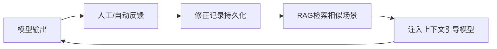

<div align="center">


# 🧠 RL Correction MCP

**强化学习辅助修正记忆系统**

[](https://www.python.org/downloads/)
[](LICENSE)
[](https://modelcontextprotocol.io/)
[](https://www.trychroma.com/)

**不修改模型权重，通过 RAG 检索修正记录引导模型行为**

[English](#english) | [中文文档](#中文文档)

</div>

---

## 中文文档

### 📖 目录

- [简介](#简介)
- [核心特性](#核心特性)
- [系统架构](#系统架构)
- [快速开始](#快速开始)
- [MCP 工具详解](#mcp-工具详解)
- [高级功能](#高级功能)
- [数据模型](#数据模型)
- [配置参考](#配置参考)
- [常见问题](#常见问题)
- [贡献指南](#贡献指南)

---

### 简介

RL Correction MCP 是一个**强化学习辅助修正装置**，采用创新的"记忆修正"理念，不修改模型权重，而是通过持久化修正记录和 RAG 检索的方式，实现对模型行为的动态引导和优化。

#### 核心思路



**工作原理：**
1. 📝 **记录修正**：当模型输出错误时，记录"错误→正确"的修正对
2. 🔍 **智能检索**：遇到相似场景时，自动检索相关修正记录
3. 💡 **上下文注入**：将检索结果注入 LLM 上下文，引导模型生成正确输出

---

### 核心特性

| 特性 | 说明 |
|------|------|
| 🎯 **精准修正** | 记录具体的错误输出和期望输出，避免模糊指导 |
| 🔄 **自动检索** | 基于 RAG 技术，自动匹配相似场景的修正记录 |
| 📊 **行为规则** | 支持定义通用行为约束（必须/禁止/建议） |
| 🏷️ **标签分类** | 支持多维度标签过滤，提升检索精确度 |
| 💾 **持久化存储** | 基于 ChromaDB，数据安全可靠 |
| 🌐 **Web 管理界面** | Vue 3 前端，可视化管理修正记录 |
| 🔌 **MCP 协议** | 标准化接口，轻松集成到 Claude、Trae 等工具 |

---

### 系统架构

```
┌─────────────────────────────────────────────────────────────┐
│                    MCP Server (FastMCP)                      │
│                                                              │
│  ┌──────────────┐   ┌──────────────┐   ┌─────────────────┐  │
│  │   工具层      │   │   检索层      │   │    存储层        │  │
│  │  server.py   │──▶│ retriever.py │──▶│   store.py      │  │
│  │  9个工具      │   │   RAG检索    │   │   ChromaDB      │  │
│  └──────────────┘   └──────────────┘   └─────────────────┘  │
│         ▲                                       ▲            │
│         │                                       │            │
│  ┌──────────────┐                     ┌─────────────────┐   │
│  │   数据模型    │                     │    Embedding     │   │
│  │  models.py   │                     │  SiliconFlow API │   │
│  │  Pydantic    │                     │  Qwen3-Embedding │   │
│  └──────────────┘                     └─────────────────┘   │
└─────────────────────────────────────────────────────────────┘
```

#### 模块说明

| 文件 | 说明 |
|------|------|
| [server.py](src/rl_correction_mcp/server.py) | MCP Server 入口，定义 9 个工具和生命周期管理 |
| [store.py](src/rl_correction_mcp/store.py) | ChromaDB 持久化存储层，管理修正记录的增删改查 |
| [retriever.py](src/rl_correction_mcp/retriever.py) | RAG 检索层，基于向量相似度搜索修正记录并格式化输出 |
| [models.py](src/rl_correction_mcp/models.py) | 数据模型定义（Pydantic），包括修正对、行为规则、检索结果等 |
| [config.py](src/rl_correction_mcp/config.py) | 配置管理，从 `.env` 文件读取环境变量 |

---

### 快速开始

#### 1️⃣ 安装依赖

**方式一：使用虚拟环境（推荐）**

```bash
# 克隆项目
git clone https://github.com/yourusername/rl-correction-mcp.git
cd rl-correction-mcp

# 创建虚拟环境
python -m venv venv

# 激活虚拟环境
# Windows:
.\venv\Scripts\activate
# Linux/macOS:
source venv/bin/activate

# 安装依赖
pip install -e ".[web]"
```

**方式二：全局安装**

```bash
pip install -e .
```

**依赖清单：**

| 包名 | 版本要求 | 用途 |
|------|----------|------|
| `mcp[cli]` | >=1.9.0 | MCP 协议框架（FastMCP） |
| `chromadb` | >=1.0.0 | 向量数据库，持久化存储修正记录 |
| `openai` | >=1.0.0 | OpenAI 兼容 API 客户端（用于 Embedding） |
| `pydantic` | >=2.0.0 | 数据模型验证 |
| `python-dotenv` | >=1.0.0 | 环境变量管理 |
| `fastapi` | >=0.100.0 | Web API 框架（可选） |
| `uvicorn` | >=0.23.0 | ASGI 服务器（可选） |

> **Python 版本要求：** >= 3.10

#### 2️⃣ 配置环境变量

```bash
# 复制配置模板
cp .env.example .env
```

编辑 `.env` 文件：

```env
# Embedding API 配置（兼容 OpenAI 格式的服务）
EMBEDDING_API_KEY=your-api-key-here
EMBEDDING_API_BASE=https://api.siliconflow.cn/v1
EMBEDDING_MODEL=Qwen/Qwen3-Embedding-8B

# ChromaDB 持久化路径
CHROMA_PERSIST_PATH=./data/chroma_db

# MCP Server 配置
MCP_SERVER_NAME=rl-correction-mcp
```

**支持的 Embedding 服务：**

| 服务商 | API Base | 推荐模型 |
|--------|----------|----------|
| SiliconFlow | `https://api.siliconflow.cn/v1` | `Qwen/Qwen3-Embedding-8B` |
| OpenAI | `https://api.openai.com/v1` | `text-embedding-3-small` |
| 本地模型 | — | `paraphrase-MiniLM-L3-v2`（需安装 sentence-transformers） |

#### 3️⃣ 启动服务

**MCP Server 模式：**

```bash
# STDIO 模式（本地使用，推荐）
python -m rl_correction_mcp.server

# HTTP 模式（远程部署）
python -m rl_correction_mcp.server --transport streamable_http --port 8000

# SSE 模式
python -m rl_correction_mcp.server --transport sse --port 8000
```

**Web API 模式：**

```bash
# 启动 FastAPI 服务
python web_api.py

# 访问 API 文档
# http://localhost:8000/docs
```

**Web 前端：**

```bash
cd web
npm install
npm run dev
# 访问 http://localhost:5173
```

#### 4️⃣ 集成到工具

**Claude Desktop 配置：**

编辑 `~/Library/Application Support/Claude/claude_desktop_config.json`（macOS）或 `%APPDATA%\Claude\claude_desktop_config.json`（Windows）：

```json
{
  "mcpServers": {
    "rl-correction": {
      "command": "python",
      "args": ["-m", "rl_correction_mcp.server"],
      "env": {
        "EMBEDDING_API_KEY": "your-key-here",
        "EMBEDDING_API_BASE": "https://api.siliconflow.cn/v1",
        "EMBEDDING_MODEL": "Qwen/Qwen3-Embedding-8B"
      }
    }
  }
}
```

**Trae / VS Code 配置：**

在 MCP 设置中添加：

```json
{
  "servers": {
    "rl-correction": {
      "type": "stdio",
      "command": "python",
      "args": ["-m", "rl_correction_mcp.server"],
      "env": {
        "EMBEDDING_API_KEY": "your-key-here"
      }
    }
  }
}
```

---

### MCP 工具详解

#### 📌 工具 1：`rlc_add_correction` — 添加三链修正对

记录模型在某个场景下的完整三链修正信息（输入链+逻辑链+输出链）。

**参数：**

| 参数 | 类型 | 必填 | 说明 |
|------|------|:----:|------|
| `raw_input` | string | ✅ | 原始输入：用户的原始问题/输入 |
| `scene_context` | string | ✅ | 场景上下文：问题发生时的压缩上下文 |
| `wrong_output` | string | ✅ | 模型的错误输出 |
| `correct_output` | string | ✅ | 期望的正确输出 |
| `quality_score` | int | ❌ | 质量评分 0-100，默认 50（越高表示修正越重要） |
| `wrong_reason` | string | ✅ | 为什么这是错误的 |
| `correct_reason` | string | ❌ | 为什么正确输出更好 |
| `wrong_cot` | string | ❌ | 错误思维链（JSON 字符串数组） |
| `correct_cot` | string | ❌ | 正确思维链（JSON 字符串数组） |
| `priority` | string | ❌ | 优先级：`P0`（关键）/ `P1`（重要）/ `P2`（次要），默认 `P1` |
| `tags` | list[string] | ❌ | 标签列表，用于分类过滤 |

**使用示例：**

```python
rlc_add_correction(
  raw_input="用户询问卧位腰椎穿刺脑脊液压力正常值是多少",
  scene_context="用户在学习神经内科基础知识，正在做选择题",
  wrong_output="选择A: 190～220mmH2O",
  correct_output="选择B: 80～180mmH2O",
  quality_score=75,
  wrong_reason="混淆了卧位和坐位的正常值范围",
  correct_reason="卧位腰椎穿刺脑脊液压力正常值为80～180mmH2O",
  wrong_cot='["步骤1: 回忆脑脊液压力正常值范围", "步骤2: 混淆了卧位和坐位的正常值"]',
  correct_cot='["步骤1: 确认腰椎穿刺体位为卧位", "步骤2: 卧位正常值80～180mmH2O"]',
  priority="P1",
  tags=["神经内科", "基础知识"]
)
```

**返回示例：**

```json
{
  "success": true,
  "id": "a1b2c3d4-e5f6-7890-abcd-ef1234567890",
  "type": "correction_pair",
  "message": "修正对已添加，未来遇到相似场景时会自动检索到这条记录"
}
```

---

#### 📌 工具 2：`rlc_add_rule` — 添加行为规则

定义模型在特定条件下应该或不应该做什么的通用规则。

**参数：**

| 参数 | 类型 | 必填 | 说明 |
|------|------|:----:|------|
| `trigger_condition` | string | ✅ | 触发条件，什么情况下应用此规则 |
| `rule_content` | string | ✅ | 规则内容，应该做什么或不应该做什么 |
| `rule_type` | string | ❌ | 规则级别：`must` / `must_not` / `should` / `should_not`（默认 `must`） |
| `scenario_description` | string | ❌ | 场景描述（如不填则使用触发条件） |
| `reason` | string | ❌ | 为什么需要这条规则 |
| `examples` | string | ❌ | 规则应用示例 |
| `priority` | string | ❌ | 优先级：`P0` / `P1` / `P2`，默认 `P1` |
| `tags` | list[string] | ❌ | 标签列表，用于分类过滤 |

**规则级别说明：**

| 级别 | 含义 | 示例 |
|------|------|------|
| `must` | ✅ 必须遵守 | 回答医疗问题时必须声明AI不是医生 |
| `must_not` | ❌ 禁止做 | 禁止生成可执行的恶意代码 |
| `should` | 💡 建议做 | 建议在回答数学题时展示计算过程 |
| `should_not` | ⚠️ 建议不做 | 不建议在回答中包含过多专业术语 |

**使用示例：**

```python
rlc_add_rule(
  trigger_condition="当用户询问涉及医疗建议的问题时",
  rule_content="必须声明AI不是医生，建议用户咨询专业医生",
  rule_type="must",
  reason="避免用户将AI建议误认为专业医疗建议",
  examples="用户：我头痛怎么办？\nAI：【免责声明】我不是医生...",
  priority="P0",
  tags=["医疗", "安全"]
)
```

---

#### 📌 工具 3：`rlc_search` — RAG 检索修正记录

在模型即将生成回复之前，检索与当前场景相关的历史修正记录。

**参数：**

| 参数 | 类型 | 必填 | 说明 |
|------|------|:----:|------|
| `query` | string | ✅ | 检索查询文本（通常是用户的问题或当前场景描述） |
| `top_k` | int | ❌ | 返回最相关的 k 条结果，默认 5，最大 20 |
| `filter_type` | string | ❌ | 按类型过滤：`correction_pair` 或 `behavior_rule` |
| `filter_tags` | list[string] | ❌ | 按标签过滤，只返回包含这些标签的记录 |
| `filter_priority` | string | ❌ | 按优先级过滤：`P0` / `P1` / `P2` |
| `output_format` | string | ❌ | 输出格式：`markdown`（默认）或 `json` |

**返回格式：**

```markdown
## 🔧 RL 行为修正提示

以下是基于历史反馈检索到的 3 条相关修正记录：

## ⚠️ 行为规则（必须遵守）

🔴 必须遵守 (相似度: 0.92)
触发条件: 当用户询问涉及医疗建议的问题时
---
必须声明AI不是医生，建议用户咨询专业医生

## 📋 修正示例（参考学习）

📋 修正示例 (相似度: 0.85)
场景: 用户询问卧位腰椎穿刺脑脊液压力正常值时
---
错误输出: 选择A: 190～220mmH2O
正确输出: 选择B: 80～180mmH2O
原因: 卧位腰椎穿刺脑脊液压力正常值为80～180mmH2O
```

---

#### 📌 工具 4：`rlc_list_all` — 列出所有修正记录

查看当前存储的所有修正对和行为规则，支持分页和类型过滤。

**参数：**

| 参数 | 类型 | 必填 | 说明 |
|------|------|:----:|------|
| `limit` | int | ❌ | 每页返回数量，默认 20，最大 100 |
| `offset` | int | ❌ | 分页偏移量，默认 0 |
| `filter_type` | string | ❌ | 按类型过滤：`correction_pair` 或 `behavior_rule` |
| `filter_priority` | string | ❌ | 按优先级过滤：`P0` / `P1` / `P2` |
| `filter_review_status` | string | ❌ | 按审核状态过滤：`pending` / `approved` / `rejected` |

---

#### 📌 工具 5：`rlc_delete` — 删除修正记录

删除指定的修正记录（修正对或行为规则）。

**参数：**

| 参数 | 类型 | 必填 | 说明 |
|------|------|:----:|------|
| `record_id` | string | ✅ | 要删除的修正记录 ID |

---

#### 📌 工具 6：`rlc_get_stats` — 获取统计信息

返回修正记忆层的整体状态统计。

**返回示例：**

```json
{
  "total_records": 42,
  "correction_pairs": 30,
  "behavior_rules": 12,
  "rule_type_breakdown": {
    "must": 5,
    "must_not": 3,
    "should": 2,
    "should_not": 2
  },
  "all_tags": ["python", "algorithm", "medical", "neurology"]
}
```

---

### 高级功能

#### 🔍 高级搜索过滤

支持多维度组合过滤，提升检索精确度：

| 过滤维度 | 说明 | 示例 |
|----------|------|------|
| **标签过滤** | 按科室、疾病类型等标签筛选 | `["内分泌", "药理"]` |
| **优先级过滤** | P0（关键）、P1（重要）、P2（次要） | `["P0", "P1"]` |
| **质量评分** | 设置最低/最高质量评分范围 | `60-100` |
| **审核状态** | 待审核、已通过、已拒绝 | `"approved"` |
| **记录类型** | 修正对、行为规则 | `"correction_pair"` |

**API 使用示例：**

```bash
# 获取可用过滤器
GET /api/search/filters

# 高级搜索
POST /api/search
{
  "query": "血糖控制",
  "top_k": 10,
  "filters": {
    "tags": ["内分泌", "药理"],
    "priority": ["P0", "P1"],
    "quality_score_min": 60,
    "review_status": "approved"
  }
}
```

#### 🌐 Web 管理界面

项目包含完整的 Vue 3 Web 管理界面：

```bash
cd web
npm install
npm run dev
```

**功能特性：**

- 🔍 高级搜索过滤器（标签、优先级、质量评分、审核状态）
- 📊 表格展示搜索结果
- 📝 展开查看完整的错误/正确逻辑链
- 📈 仪表板统计展示
- ✏️ 修正记录管理（增删改查）
- 🎨 现代化 UI 设计（Element Plus）

---

### 数据模型

#### CorrectionPair（修正对）

```json
{
  "id": "uuid",
  "type": "correction_pair",
  "input_chain": {
    "raw_input": "用户的原始输入",
    "scene_context": "场景上下文"
  },
  "logic_chain": {
    "correct_logic": "正确的逻辑链",
    "wrong_logic": "错误的逻辑链"
  },
  "output_chain": {
    "correct_output": "期望的正确输出",
    "wrong_output": "模型的错误输出"
  },
  "reason": "修正原因（可选）",
  "tags": ["标签1", "标签2"],
  "created_at": "2025-01-01T12:00:00+00:00"
}
```

#### BehaviorRule（行为规则）

```json
{
  "id": "uuid",
  "type": "behavior_rule",
  "trigger_condition": "触发条件",
  "rule_content": "规则内容",
  "rule_type": "must",
  "reason": "规则原因（可选）",
  "tags": ["标签1", "标签2"],
  "created_at": "2025-01-01T12:00:00+00:00"
}
```

---

### 配置参考

#### 环境变量

| 变量名 | 必填 | 默认值 | 说明 |
|--------|:----:|--------|------|
| `EMBEDDING_API_KEY` | ✅ | — | Embedding API 密钥 |
| `EMBEDDING_API_BASE` | ❌ | `https://api.siliconflow.cn/v1` | Embedding API 地址 |
| `EMBEDDING_MODEL` | ❌ | `Qwen/Qwen3-Embedding-8B` | Embedding 模型名称 |
| `CHROMA_PERSIST_PATH` | ❌ | `./data/chroma_db` | ChromaDB 数据持久化路径 |
| `MCP_SERVER_NAME` | ❌ | `rl-correction-mcp` | MCP Server 名称 |

#### 启动参数

| 参数 | 默认值 | 说明 |
|------|--------|------|
| `--transport` | `stdio` | 传输协议：`stdio` / `streamable_http` / `sse` |
| `--host` | `127.0.0.1` | HTTP 模式的主机地址 |
| `--port` | `8000` | HTTP 模式的端口号 |

---

### 常见问题

<details>
<summary><b>❓ 如何选择 Embedding 模型？</b></summary>

- **云端 API（推荐）**：SiliconFlow 的 `Qwen/Qwen3-Embedding-8B`，效果好、成本低
- **本地模型**：`paraphrase-MiniLM-L3-v2`，无需 API 密钥，但效果稍差
- **OpenAI**：`text-embedding-3-small`，稳定可靠，但成本较高

</details>

<details>
<summary><b>❓ 数据存储在哪里？</b></summary>

所有数据存储在 `CHROMA_PERSIST_PATH` 指定的目录（默认 `./data/chroma_db/`），包括：
- 向量索引文件
- 元数据数据库（SQLite）
- 原始 JSON 记录

重启服务后数据不会丢失。

</details>

<details>
<summary><b>❓ 如何迁移数据？</b></summary>

直接复制 `data/chroma_db/` 目录到新环境，确保 `CHROMA_PERSIST_PATH` 配置正确即可。

</details>

<details>
<summary><b>❓ 支持哪些 MCP 客户端？</b></summary>

理论上支持所有 MCP 协议的客户端，已测试：
- ✅ Claude Desktop
- ✅ Trae
- ✅ VS Code（MCP 扩展）
- ✅ 其他 MCP 兼容工具

</details>

<details>
<summary><b>❓ 如何贡献代码？</b></summary>

欢迎提交 Issue 和 Pull Request！请查看 [贡献指南](#贡献指南)。

</details>

---

### 贡献指南

我们欢迎所有形式的贡献！

#### 开发环境设置

```bash
# 克隆仓库
git clone https://github.com/yourusername/rl-correction-mcp.git
cd rl-correction-mcp

# 创建虚拟环境
python -m venv venv
source venv/bin/activate  # Linux/macOS
# 或 .\venv\Scripts\activate  # Windows

# 安装开发依赖
pip install -e ".[dev]"

# 运行测试
pytest tests/

# 代码格式化
black src/
isort src/
```

#### 提交规范

请遵循 [Conventional Commits](https://www.conventionalcommits.org/) 规范：

- `feat: 添加新功能`
- `fix: 修复 bug`
- `docs: 更新文档`
- `style: 代码格式调整`
- `refactor: 代码重构`
- `test: 添加测试`
- `chore: 构建/工具链更新`

---

### 目录结构

```
rl-correction-mcp/
├── .env                          # 环境变量配置（需自行创建）
├── .env.example                  # 环境变量模板
├── pyproject.toml                # 项目配置和依赖
├── README.md                     # 本文档
├── web_api.py                    # FastAPI Web 服务
├── data/
│   └── chroma_db/                # ChromaDB 持久化数据
│       ├── chroma.sqlite3        # 元数据数据库
│       └── {uuid}/               # 向量数据文件
├── web/                          # Vue 3 前端
│   ├── src/
│   │   ├── views/                # 页面组件
│   │   ├── stores/               # Pinia 状态管理
│   │   └── router/               # 路由配置
│   └── package.json
└── src/
    └── rl_correction_mcp/
        ├── __init__.py
        ├── __main__.py           # python -m 入口
        ├── config.py             # 配置管理
        ├── models.py             # 数据模型（Pydantic）
        ├── store.py              # ChromaDB 存储层
        ├── retriever.py          # RAG 检索层
        └── server.py             # MCP Server（6个工具）
```

---

### License

[MIT License](LICENSE)

---

### 致谢

- [MCP](https://modelcontextprotocol.io/) - Model Context Protocol
- [ChromaDB](https://www.trychroma.com/) - 开源向量数据库
- [FastMCP](https://github.com/anthropics/mcp) - MCP Python SDK
- [SiliconFlow](https://siliconflow.cn/) - Embedding API 服务

---

<div align="center">

**如果这个项目对你有帮助，请给一个 ⭐️ Star！**

Made with ❤️ by RL Correction Team

</div>

---

## English

### Introduction

RL Correction MCP is a **Reinforcement Learning Assisted Correction System** that uses an innovative "memory correction" approach. Instead of modifying model weights, it dynamically guides and optimizes model behavior through persistent correction records and RAG retrieval.

### Quick Start

```bash
# Install
pip install -e ".[web]"

# Configure
cp .env.example .env
# Edit .env with your API keys

# Run MCP Server
python -m rl_correction_mcp.server

# Run Web API
python web_api.py
```

### Features

- 🎯 Precise correction with error/expected output pairs
- 🔄 Automatic RAG-based retrieval for similar scenarios
- 📊 Behavior rules support (must/must_not/should/should_not)
- 🏷️ Multi-dimensional tag filtering
- 💾 Persistent storage with ChromaDB
- 🌐 Vue 3 Web management interface
- 🔌 Standard MCP protocol integration

### Documentation

For detailed documentation, please refer to the [Chinese documentation](#中文文档) above or check our [Wiki](https://github.com/yourusername/rl-correction-mcp/wiki).

### License

[MIT License](LICENSE)
